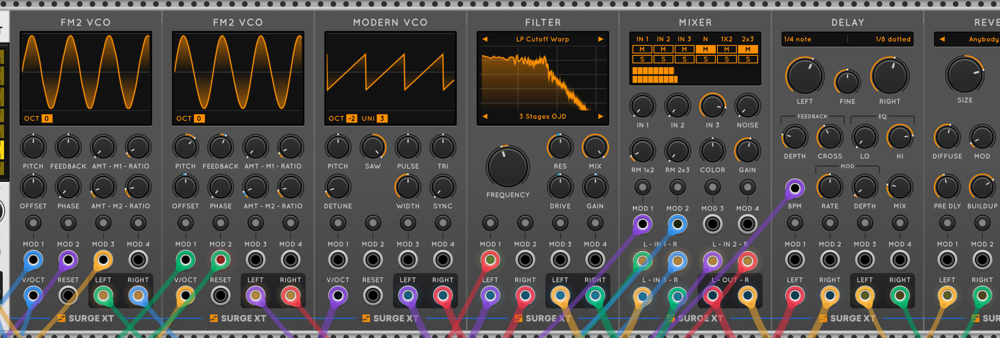
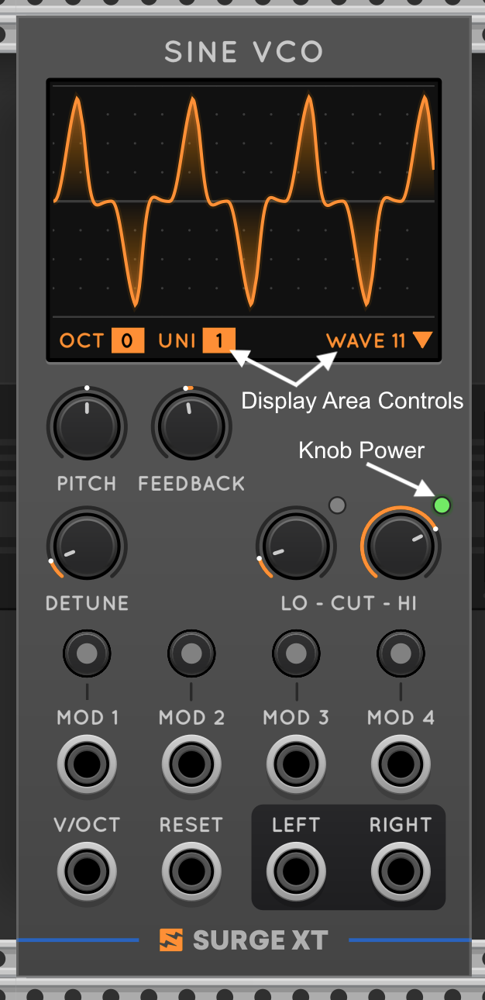

Surge XT is a collection of modules for VCV Rack which brings the majority of the DSP code
from the synth into the Rack environment in a modern, carefully designed fashion.

{:.no_toc}
 
## Table of Contents
{:.no_toc}

* unordered list
{:toc}

# Omri Cohen's Overview Video

A great starting  point if you are impatient is to just
watch our beta-day launch video from Omri Cohen. Thanks for making such a great
video, Omri, and awesome flute playing!

<iframe width="560" height="315" 
        src="https://www.youtube.com/embed/8MavXLbI50A" 
        title="Sound Design Heaven - Omri Cohen demonstrates Surge XT in Rack" 
        frameborder="0" 
        allow="accelerometer; autoplay; clipboard-write; encrypted-media; gyroscope; picture-in-picture" 
        allowfullscreen></iframe>

# Collection Overview

Surge XT contains a collection of modules which project the core capabilities of the
Surge XT synth into VCV Rack. It contains multiple VCOs, multiple FX, a Filter module
with a large number of complicated filter modes, a Waveshaper with multiple shaper models,
an LFO/Envelope Generator module, and a collection of utility modules.

This manual covers how to use these modules in VCV Rack, but it is intended to be read in
conjunction with the [Surge XT Manual](/manual). Concepts like the meaning of a 
particular setting in a VCO or a particular knob on an effect are covered there in detail,
and we won't repeat that information here.

# Core Concepts

The module set strives for a high degree of consistency in the panels, and there are several
core concepts which cover nearly every module which you should understand before you turn
to the particular modules.

## Knobs, Switches, and Display Area Controls

All Surge XT modules share a few basic features, shown in the above annotated image of the
Sine VCO and the . All components in Surge XT support the full set of Rack 2 features, including
value tooltips and typeins, using the standard Rack gestures. We can see almost all the
core UI features on the screenshot above of the Sine and Flanger modules.

- Knobs with rings to show their value, which can either be uni- or bi-polar. Knobs
  are labeled, and some panels have dynamic labels below knobs.
- Toggleable knbos have power buttons (here the green lit button above HI CUT in the Sine). For these
  you need to toggle the knob "On" for the feature to be in effect.
- Controls in the display area (here unison, octave, and wave shape in the Sine). Items with
  a downward facing arrow will popup menus in VCOs, In FX, controls in the preset area (like
  combs only and sine in the Flanger image) will open a multi-choice menu. As well as providing
  menus, these controls generally react to a drag event like a knob or slider.
- Presets and Model Choices (here the item at the top of the flanger) which have left-right jog buttons
  and open a menu when selected.

The modules with display area charts will udpate those charts in realtime based on values
and modulations. We endeavour to make sure the charts show what is actually happening
in an appropriate fashion!

## Modulation

Surge XT contains an advanced modulation system where every module contains a many-to-many
modulation matrix from 4 CV inputs to each of the knobs. You can plug a CV input into any of the
mod inputs then "arm" that editor with the button above. Once armed each knob will switch from 
a value display to a modulation depth display. Drag the knob to attenuate the inbound modulation,
and use shift-alt drag to edit the underlyer knob when in modulation mode

Modulation bounds show as a bipolar level which show the impact of a + or -10V signal. If you are using
a +/-5V modulator (as opposed to a 0-10v modulator) you may need to set your depth higher.

This is still a draft. If it doesn't make sense, just watch Omris video for now OK?

## Polyphony

All the Surge XT modules are Polyphonic. Polyphony is driven by natural inputs
(V/Oct, Trigger, and so on) in each module. Each of the FX (except the Delays, as
discussed below) can work either monophonically, summing inputs, or optionally 
polyphonically, with an instance of the FX per channel.

Modulation inputs do *not* set polyphony in modules. Instead, a module which has
polyphony P will interact with modulation with polyphony M as follows:

1. P=1, M=1: This is the simple case. It's just all monophonic!
2. P=n, M=n; if the polyphonys match, each modulator addresses each voice
3. P=n, M=1; if the module is polyphonic and the modulator monophonic, the
   modulator is broadcast to each polyphonic voice
3. P=n; M=m, m!=n; In this case the first m modulator channels are used for
   the first m voices, and any voice n > m gets modulation value 0.

## TempoSync and Clocks

CLOCK inputs can take either quarter note inputs or BPM CV. You can toggle which
one a clock takes in the right mouse menu for a module. BPM CV uses the rack standard
and matches popular modules such as CLOCKED.

## Extra Controls in the Menus

I mean, it's still Surge right? There's loads of stuff in the menus. Always click.

## Block Size and Latency

By virtue of being a VST, Surge is designed for a block-processing environment as
opposed to a per-sample processing environment. This means there are a collection
of places where latency can appear or modulators are snapped less frequently than
per sample.

Luckily, in the Surge XT modules, we have undertaken the work to make the Surge code
base use a compile time variable block size, and for the Rack implementation, set the
module block size to 8 samples, greatly improved from the 32 sample condition
in the prior rack implementation.

Each module type has a slightly different strategy, which is detailed below. With 
a block size of 8 this probably doesn't matter to you much, but if you are doing careful
phase work, or if you try to do things like filter fm, it won't work or won't work the
way you expect.

# The VCOs

# The VCF and Waveshaper

# The Surge Effects

# The Surge LFOxEG

# Other modules and effects

## The Two Delays

## The Mixer

## The Mod Matrix
